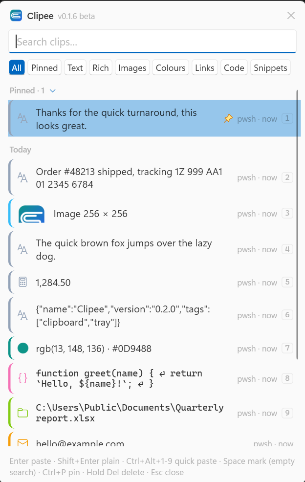

# Clipee

**A fast, private clipboard manager for Windows.** Clipee remembers everything you copy, so you can find it and paste it again later. It waits in the system tray and opens with one shortcut.

## Download

**[⬇ Download Clipee for Windows](https://github.com/markticulous/Clipee/releases/latest)**, then run **`Clipee-win-Setup.exe`**.

- Installs for your Windows account only. No administrator password needed.
- If Windows says **"Windows protected your PC"**, click **More info → Run anyway**. Clipee is new and isn't code-signed yet.
- If double-clicking does nothing, Windows has blocked the download: right-click the file → **Properties** → tick **Unblock** → **OK**, then run it again.
- Needs Windows 10 or 11. If your PC doesn't have the .NET 10 Desktop Runtime, the installer fetches it.

Clipee updates itself in the background. You never need to download it again.

## How to use it

1. Copy things as usual with **Ctrl+C**.
2. Press **Ctrl+Alt+V** where you want to paste.
3. Pick a clip with the arrow keys, or type to search, and press **Enter**.

The full **User Guide** opens from **Settings → User Guide** inside Clipee.

## What it does

- **Finds anything you copied**: search as you type, plus filters for links, colours, code, images and more.
- **Pins** the clips you use all the time, and keeps **snippets** with placeholders like `{date}`.
- **Pastes power-user style**: Ctrl+Alt+1…9 pastes your newest clips without opening anything, a paste stack fills forms one field at a time, and *Paste as* changes case, joins lines or tidies JSON.
- **Reads text from screenshots** (OCR), and shows colour swatches for colour codes.
- **Backs up** your history to a password-protected file, automatically if you like.
- **Stays light**: about 10 MB of memory when idle.

## Your privacy

- Your clips stay **on your PC only**, in an **encrypted** database.
- Clipee **skips passwords** from password managers and anything that looks like an API key or token. You choose, in Settings → Privacy.
- **Ignore any app** in two clicks: pick it from a list of apps that have copied, or right-click one of its clips.
- No account, no tracking, no analytics. The only network request is the daily update check to this page.

## Feedback

Found a problem or have an idea? [Open an issue](https://github.com/markticulous/Clipee/issues).

---

A Markticulous build · © Markticulous
